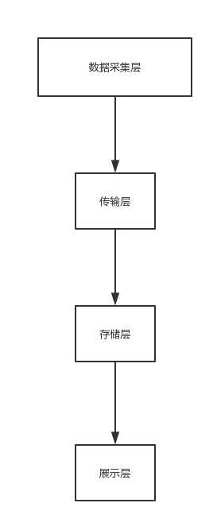

## snakeapm

| 作者 | 版本 |  日期 | 备注
|----|:----:|:-----|-----
|  | v1.0 | 2018-11-22 | 初始化

## 一. 定义

名称:全链路性能检测框架

## 二.功能

1.零代码嵌入，javaagent方式启动
2.支持容器，jar包启动方式
3.支持应用之间的链路调用(暂支持http,后续调用支持rpc方式)
4.支持方法级别的采集
5.支持分布式采集(通过zk生成全局id)
6.后续支持jdbc,redis等采集

## 三.原理

1.基于java5提供的Instrumentation机制(jvm提供的Attach机制)
[原理](https://www.ibm.com/developerworks/cn/java/j-lo-instrumentation/)

2.基于java动态类加载机制

3.基于动态字节码修改工具修改字节码(Asm,javaassist,bytebuddy),本项目基于bytebuddy(简单好用)
[bytebuddy官网](http://bytebuddy.net/#/)

## 四.架构




### 说明：

1.所用模块都是可拔插设计(类似于dubbo的spi机制)

2.模块之间无紧耦合，可以随意增加删除

3.无需改变源代码，动态修改字节码，可以查看字节码修改后的状态


#### 采集层：
 1.负责数据的采集，主要分为agent模块,plugin模块(支持组件)，数据暂存模块(队列)
 2.现支持servlet,http,spring等方法级别的采集
 
 todo
 1.后续扩展支持rpc(dubbo)，jdbc,redis等组件
 2.后续开发基于jmx的jvm指标监控

### 传输层
 1.目前支持的okhttp传输数据
 
 todo
 1.扩展基于http，基于netty的tcp传输，基于MQ的数据传输

### 存储层
 1.暂时只是输出到控制台
 
 todo
 1.后续要持久化存储(Elasticsearch,mysql等)
 
### 展示层
  1.暂无，后续会开发数据展示，链路展示
  

###采集数据样例

```json
[
    {
        "cluster": "snake-1",
        "gid": "50001812071537391",
        "id": "50001812071537395",
        "ip": "127.0.0.1",
        "pid": "50001812071537394",
        "port": "7000",
        "server": "snake",
        "spend": 1,
        "tags": {
            "method": "execute",
            "clazz": "cn.learn.spring.boot.snake.controller.HttpClient3xController"
        },
        "time": 1544168259313,
        "type": "proc"
    },
    {
        "id": "50001812071537395",
        "tags": {
            "param": [
                "--"
            ]
        },
        "type": "para"
    },
    {
        "cluster": "snake-1",
        "gid": "50001812071537391",
        "id": "50001812071537394",
        "ip": "127.0.0.1",
        "pid": "50001812071537393",
        "port": "7000",
        "server": "snake",
        "spend": 21,
        "tags": {
            "srcInst": "snake",
            "method": "GET",
            "srcApp": "snake-1",
            "remote": "127.0.0.1",
            "url": "http://localhost:7005/execute"
        },
        "time": 1544168259304,
        "type": "req"
    },
    {
        "cluster": "snake-1",
        "id": "50001812071537394",
        "ip": "127.0.0.1",
        "port": "7000",
        "server": "snake",
        "tags": {
            "param": "{}"
        },
        "time": 1544168259325,
        "type": "rp"
    },
    {
        "cluster": "snake-1",
        "id": "50001812071537394",
        "ip": "127.0.0.1",
        "port": "7000",
        "server": "snake",
        "tags": {
            "headers": "{\"snake-ctag\":\"\",\"snake-src-cluster\":\"snake-1\",\"snake-gid\":\"50001812071537391\",\"snake-src-server\":\"snake\",\"host\":\"localhost:7005\",\"snake-pid\":\"50001812071537393\",\"user-agent\":\"Jakarta Commons-HttpClient/3.1\"}"
        },
        "time": 1544168259325,
        "type": "reqh"
    },
    {
        "cluster": "snake-1",
        "gid": "50001812071537391",
        "id": "50001812071537393",
        "ip": "127.0.0.1",
        "pid": "50001812071537392",
        "port": "7000",
        "server": "snake",
        "spend": 124,
        "tags": {
            "method": "request",
            "clazz": "cn.learn.spring.boot.snake.controller.HttpClient3xController"
        },
        "time": 1544168259206,
        "type": "proc"
    },
    {
        "cluster": "snake-1",
        "gid": "50001812071537391",
        "id": "50001812071537392",
        "ip": "127.0.0.1",
        "pid": "nvl",
        "port": "7000",
        "server": "snake",
        "spend": 125,
        "tags": {
            "method": "GET",
            "remote": "0:0:0:0:0:0:0:1",
            "url": "http://localhost:7005/http3x"
        },
        "time": 1544168259206,
        "type": "req"
    },
    {
        "cluster": "snake-1",
        "id": "50001812071537392",
        "ip": "127.0.0.1",
        "port": "7000",
        "server": "snake",
        "tags": {
            "param": "{}"
        },
        "time": 1544168259331,
        "type": "rp"
    },
    {
        "cluster": "snake-1",
        "id": "50001812071537392",
        "ip": "127.0.0.1",
        "port": "7000",
        "server": "snake",
        "tags": {
            "headers": "{\"postman-token\":\"102a4273-af17-4fb4-9b0d-6fb9a4578c76\",\"host\":\"localhost:7005\",\"connection\":\"keep-alive\",\"cache-control\":\"no-cache\",\"accept-encoding\":\"gzip, deflate\",\"user-agent\":\"PostmanRuntime/7.4.0\",\"accept\":\"*/*\"}"
        },
        "time": 1544168259331,
        "type": "reqh"
    },
    {
        "cluster": "snake-1",
        "id": "50001812071537392",
        "ip": "127.0.0.1",
        "port": "7000",
        "server": "snake",
        "tags": {
            "body": "success"
        },
        "time": 1544168259331,
        "type": "resb"
    }
]
```


###性能数据
 1.暂无
 
